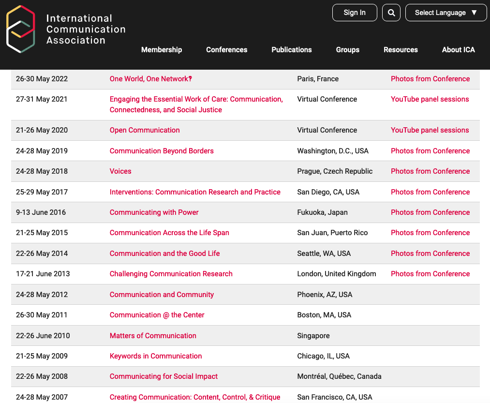

# ICA Conference Data Explorer 

## Why this project?

It surprised me that we had over 20 years of data of [ICA annual conferences](https://www.icahdq.org/page/PastFuture) and yet no one has organized it in a way that every researcher has easy access to it. It is a painful effort to scrape all the data manually and I do not expect every scholar to do that. 

But why ICA conference data? Why do we need it? What is it good for? I have the following ideas:

  1. To inspire new research ideas. Right now, most communication literature came from journal papers (searched mostly in Google Scholar). Findings from conferences may provide a new perspective and inspire new directions. 

  2. Publications might have biases (For example, https://doi.org/10.1093/hcr/hqz015). Not all research projects end up being published. To circumbent publication bias, it is important to see the topics that are researched but not published (This idea is inspired by Yiwei Xu from Cornell). ICA annual conferences are a good starting point for communication science. Note that ICA annual conferences are peer reviewed and selective. Therefore, even though they are not publisehd, their quality is still quaranteed. This is different from non peer-review preprints. 

  3. For larger scientometric analysis. The ICA annual conference data that we collected is larger. It contains over 30K papers and 70K authors (a rough guess). This dataset is useful for large scale scientometric analysis. For example, to study the topic evolution of communication studies in the past 20 years or to study academic collaboration or mobility within the filed of communication 

  4. Contribute to open science. We aim to make our dataset public so that other researchers have equal access to these data (from Yiwei)

  5. With these data, we can understand the diversity of communication scholars & research topics better. Right now, we only have acess to journal data, but that is only part of communication scholars and communication research. To get a broader picture and a deeper understanding, we need data about the conference as well. 

## Data sources

- [ICA 2003](https://convention2.allacademic.com/one/ica/ica03/)
- [ICA 2004](https://convention2.allacademic.com/one/ica/ica04/)
- [ICA 2005](https://convention2.allacademic.com/one/ica/ica05/)
- [ICA 2006](https://convention2.allacademic.com/one/ica/ica06/)
- [ICA 2007](https://convention2.allacademic.com/one/ica/ica07/)
- [ICA 2008](https://convention2.allacademic.com/one/ica/ica08/)
- [ICA 2009](https://convention2.allacademic.com/one/ica/ica09/)
- [ICA 2010](https://convention2.allacademic.com/one/ica/ica10/)
- [ICA 2011](https://convention2.allacademic.com/one/ica/ica11/)
- [ICA 2012](https://convention2.allacademic.com/one/ica/ica12/)
- [ICA 2013](https://convention2.allacademic.com/one/ica/ica13/)
- [ICA 2014](https://convention2.allacademic.com/one/ica/ica14/)
- [ICA 2015](https://convention2.allacademic.com/one/ica/ica15/)
- [ICA 2016](https://convention2.allacademic.com/one/ica/ica16/)
- [ICA 2017](https://convention2.allacademic.com/one/ica/ica17/)
- [ICA 2018](https://convention2.allacademic.com/one/ica/ica18/)

## Plans

I am thinking of (1) design an interactive paper explorationn system, (2) clean and make public the the dataset, and (3) write a paper based on preliminary results. I do not plan to do comprehensive analyses based on the data; that is the job for other scholars if they want to use our dataset. 

## Introduction to this Repository

This repository now has three folders: 

  - Data: where all data is stored. 
  - Notebooks: this is for exploratory coding. It is mainly useful for me, but maynot be useful for others. 
  - Workflow: this is where all the codes are stored, mostly scrapers and data processing scripts. 

## Data

You do not need to pay any attention to folders of `deprecated`. Right now, all preliminary data is stored in the folder of `interim`. 

The folder of `processed` contains data that are ready to analyze and visualize. There are three files now:
  - `paper_df.csv`: This is paper data. 
  - `author_df.csv`: author data
  - `session_df.csv`: session data

### Paper Data

Paper data has the following columns:
  - `Paper ID`: I assigned an ID to each paper, in the format of `year-index`
  - `Title`: the title of this conference paper
  - `Paper Type`: the type of this presentation, either `Paper` or `Poster`. Note that the ICA website did not distinguish these two types until 2014. Therefore, all presentations prior to 2014 are classified as `Paper`, even though they might have been `Poster` instead.
  - `Abstract`: paper abstract
  - `Number of Authors`: number of authors in this paper
  - `Year`: the year when this paper was presented
  - `Session`: the specific session title
  - `Division/Unit`: the division (unit) this session is organized by. 

### Author Data

Author data has the following columns:
  - `Paper ID`: I assigned an ID to each paper, in the format of `year-index`
  - `Paper Title`: the title of this conference paper
  - `Year`: the year when this paper was presented
  - `Number of Authors`: number of authors in this paper
  - `Author Position`: the position of this author
  - `Author Name`: author name
  - `Author Affiliation`: author affiliation

### Session Data

Session data has the following columns:
  - `Year`: the year when this session occurred
  - `Session Type`: either `paper session` or `interactive paper session` (i.e., poster session)
  - `Session Title`: the title of this session
  - `Division/Unit`: the division/unit this session is organized by
  - `Chair Name`: the name of this session chair
  - `Chair Affiliation`: the affiliation of this session chair

## Workflow

I used [`snakemake`](https://github.com/hongtaoh/snakemake-tutorial) to manage the workflow. Details are in `Snakefile`.

### Scripts

- `scrape_2003_2004.py` scraped all data from 2003 to 2004

- `scrape_2005_2013.py` scraped all data from 2005 to 2013

- `scrape_2014_onward_paper_session.py` scraped data from 2014 to 2018, for the paper sessions. 

- `scrape_2014_onward_interactive_paper.py` scraped data for posters (extended abstracts) from 2014 to 2018. 

- `combine_all_data.py` cleaned, organized, and concatenated data. 